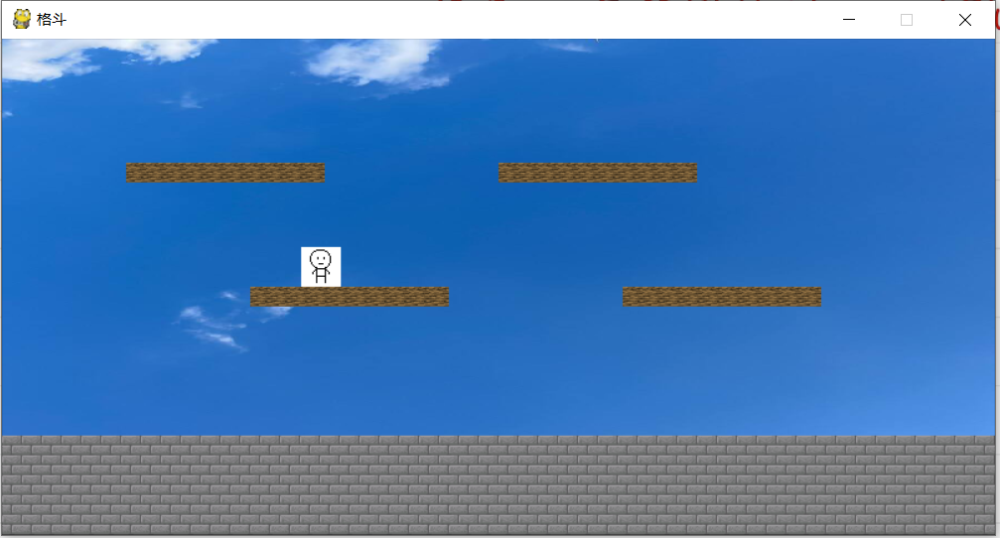

# Pygame_Battle
A pygame battle game made by a high school student of NSFZ（南师附中学生搞出来的小游戏）

## Background（背景）
> Gun gun long river goes to east, the waves wash away all heroes.  
> Yes or no, success or failure, turn your head and it's gone.  
> The green montain is still here, how many times shone by the dusk sun.  
> With white hair I fish on the river, regularly seeing moon and spring wind.  
> Using some cheap wine to celebrate unity.  
> Discussing the events through history with laughter.  

> 滚滚长江东逝水，浪花淘尽英雄。  
> 是非成败转头空。  
> 青山依旧在，几度夕阳红。  
> 白发渔樵江渚上，惯看秋月春风。  
> 一壶浊酒喜相逢。  
> 古今多少事，都付笑谈中。
  
That was a day of many years ago(maybe not that many). I wasn't at NSFZ but at NFLS. It was a lovely day of junior 3 and some students were playing 24 points.
Some of the pairs were really hard and none of us could work them out. A OIer used technology and solved the problem very quickly. Very quickly indeed.  
那是很久很久之前的事情了（也没那么长）。我还没来NSFZ，还在NFLS。那是初三的美好的一日，有一些同学在玩24点。
有一些组合非常困难以至于我们并没有人会做。但是当时一名信息竞赛选手开科技很快解决了问题。很快啊。

He first printed this fantastic poem in his program. So today as I started my program, I decided to use this poem as well.  
他首先在程序里输出了这首优美的诗句。所以今天我创建了自己的项目时，我决定也使用这优美的诗篇。

> "The vice monitor of the Developers' club is like an idiot."I said angrily.

> “开发者社的副社长是个**。”我愤怒地说。

I started programing in junior two and I really enjoys it. So when it's time to chose a club to join in NSFZ, I chose the developers' club without hesitation though the club leader looked very unreliable.  
我从初二开始写程序而且我非常喜欢。所以高一选择社团时，尽管开发者社社长很不靠谱，我还是毫不犹豫地选择了开发者社。

I made some friends, and some helped me developing. Now let's get to the program.  
我交了一些朋友，有一些帮助我开发。现在来看一看这个项目本身吧。

## The Program Itself（项目本身）

### [22w01a](./22w01a/fight.py)

> "The last program is not good. Let's start a new battle game." I announced.

> “上一个项目流产了，上个新格斗项目吧。”我宣布。

As the first version of the program, its aim is to show a basic idea. Also, this version has nothing to do with battling.  
作为项目的第一个版本，它的目的只是展现基本的思路。而且，这个版本和格斗没有一点关系。

Main features（主要特性）
- Move 左右运动
- Jump 跳跃
- Map collide 地图碰撞判定
- Jump down 下来

